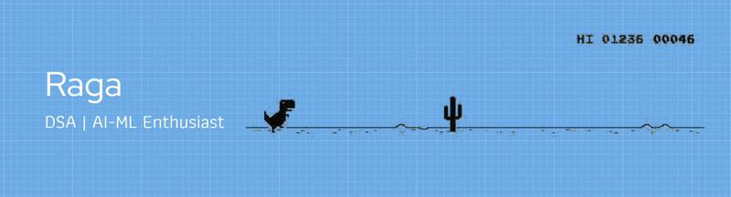

  

## About Me:
Hi! I'm RAGA

A 3rd-year Computer Science (AI & ML) student at KIT-KalaignarKarunanidhi Institute of Technology, deeply passionate about solving real-world problems through Machine Learning and AI. I thrive on coding, data structures & algorithms (DSA), and competitive programming, constantly pushing myself to improve

## Socials:
  

# Languages:

# Frameworks and Libraries:

# Database & Tools:

# Github Stats:

    
    
    

### Top Contributed Repo

---

<!-- Proudly created with GPRM ( https://gprm.itsvg.in ) -->
